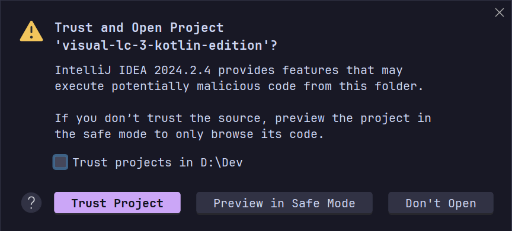
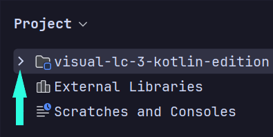
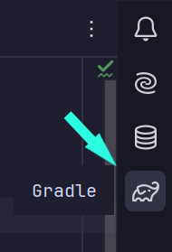
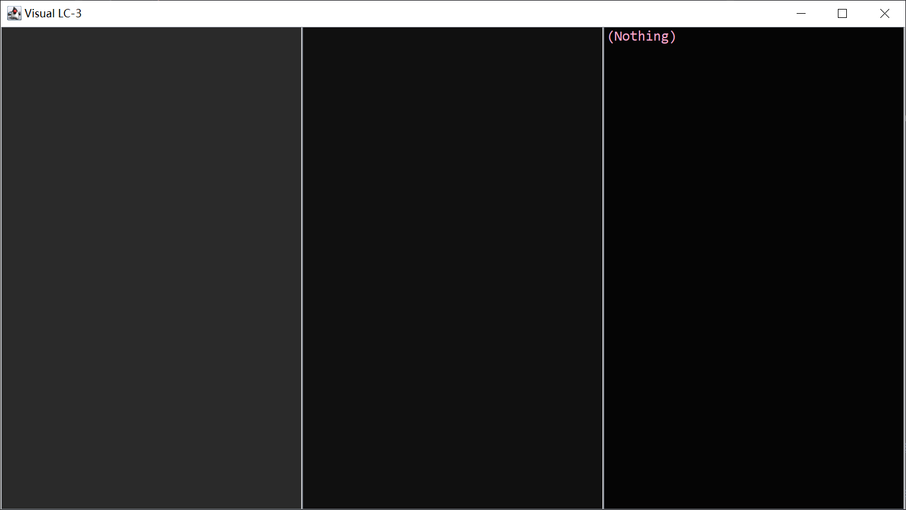
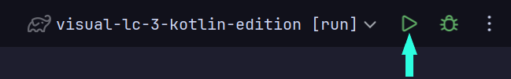
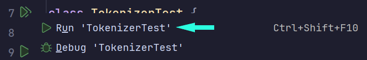
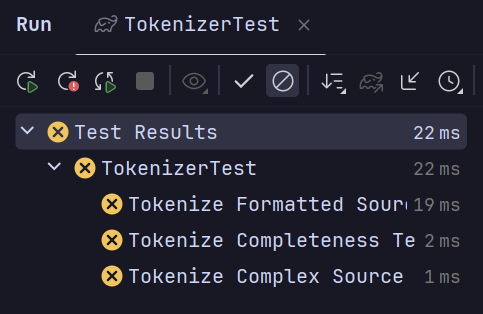
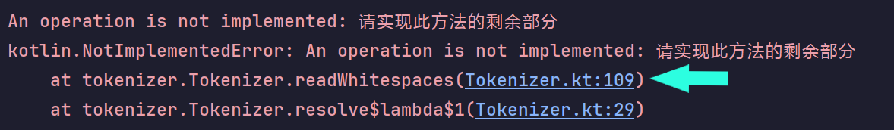
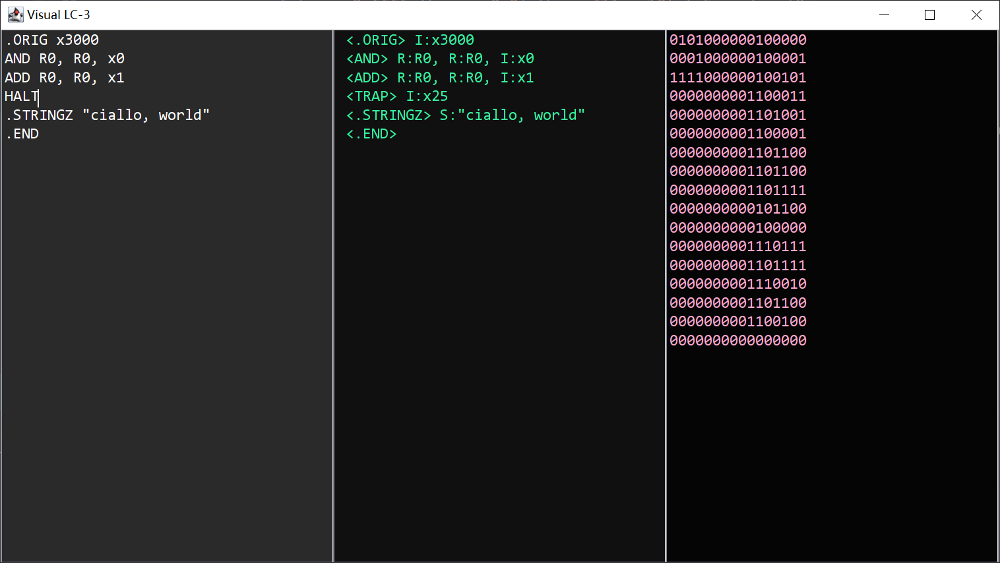

# Visual LC-3 代码模板（Kotlin）

?> 在继续前，请确保你已经阅读过 [本项目的概述](/Labs/LA/Gen)。

## 概述

这篇文档介绍如何使用基于 Kotlin 的框架，完成 Visual LC-3 项目的开发。我们将整个开发过程划分为几个阶段，这些阶段有先后关系 —— **完成一个阶段，才能继续下一个阶段**。不过不必感到紧张，按照下面的计划推进，事情会简单许多。

## 开发计划

### 阶段 0：搭设开发环境

你将需要以下资源：

- **Java 开发工具包（JDK）**
  
  我们使用的 Kotlin 基于 Java 虚拟机来运行，因此要先设置 Java 开发环境。开发所使用的版本是 Java 21。
  
  你可以从 [Adoptium 下载页面](https://adoptium.net/zh-CN/temurin/releases/?package=jdk&version=21) 下载 JDK，或者从下面的镜像获取：
  
  - [Windows x64](https://mirrors.ustc.edu.cn/adoptium/releases/temurin21-binaries/LatestRelease/OpenJDK21U-jdk_x64_windows_hotspot_21.0.5_11.msi)
  
  - [macOS x64](https://mirrors.ustc.edu.cn/adoptium/releases/temurin21-binaries/LatestRelease/OpenJDK21U-jdk_x64_mac_hotspot_21.0.5_11.pkg)
  
  - [macOS ARM](https://mirrors.ustc.edu.cn/adoptium/releases/temurin21-binaries/LatestRelease/OpenJDK21U-jdk_aarch64_mac_hotspot_21.0.5_11.pkg)
  
  - [GNU/Linux x64](https://mirrors.ustc.edu.cn/adoptium/releases/temurin21-binaries/LatestRelease/OpenJDK21U-jdk_x64_linux_hotspot_21.0.5_11.tar.gz)
  
  对于其它操作系统或架构，请在官方网站上获取安装程序。
  
  ?> 如果你的电脑上同时还安装有 Minecraft，在安装了额外的 JDK 后，可能需要重新配置启动器，以免它们自动选中新安装的 JDK。

- **IntelliJ IDEA（社区版）**
  
  强大、易用而且免费的集成开发环境（IDE），你可以从 [JetBrains 的官方网站](https://www.jetbrains.com/idea/download/download-thanks.html?platform=windows&code=IIC) 上下载安装程序。
  
  ?> 如果你愿意，并且也知道如何使用，可以使用 Visual Studio Code、Eclipse 或者其它编辑器完成开发，但你将需要手动设置 Gradle 并运行测试。
  
  !> 尽管 IDEA 拥有中文翻译插件，但我们并不建议你使用它。请先尝试以英文界面操作，只在绝对必要时才使用翻译。

- **Git 版本管理工具**
  
  Git 是一个用于拉取、推送和管理不同版本源代码的工具，我们将使用 Git 来获取项目的源代码。你可以从 [Git 官方网站](https://git-scm.com/downloads) 下载 Git，安装时使用默认选项即可。

### 阶段 1：获取模板代码

模板代码存储在 [USTC LUG 的 GitLab](https://git.lug.ustc.edu.cn/skjsjhb/visual-lc-3-kotlin-edition) 上，在此向参与维护这项服务的志愿者表示诚挚的感谢。

有两种方法可以获取源代码：

- 手动下载源代码并打开项目：
  
  1. 从 [这里](https://git.lug.ustc.edu.cn/skjsjhb/visual-lc-3-kotlin-edition/-/archive/main/visual-lc-3-kotlin-edition-main.zip) 下载源码包，并解压下载的 zip 归档，将其放到你希望存储项目的位置。
  
  2. 打开 IDEA，在主界面上单击 **Open**，并选择下载的源代码目录。

- 使用 IDEA 的版本管理工具：
  
  1. 打开 IDEA，在主界面上单击 **Clone Repository**。
  
  2. 在弹出窗口的 **URL** 一栏中，填入以下内容：
     
     ```
     https://git.lug.ustc.edu.cn/skjsjhb/visual-lc-3-kotlin-edition.git
     ```
  
  3. 在 **Directory** 一栏中，填写你希望存储项目的位置。
  
  4. 单击 **Clone** 按钮。

在打开项目后，你可能会看到如下的警告：



单击 **Trust Project** 以信任源代码并打开项目。如果你担心源代码的安全性，也可以使用 **Preview in Safe Mode** 进行预览。

打开项目后，你将注意到右下角会显示 **Importing...** 等字样，稍等一会儿，直到右下角的进度条消失，代表项目导入成功。

> **如果出问题**
> 
> 有时你可能会看到这样的错误提示：
> 
> 
> 
> 这代表“同步错误”，也就是 Gradle（我们的构建工具）无法下载编译项目所需要的文件。我们在搭设环境时手动安装了 JDK 和 IDEA，但是并没有安装 Kotlin 编译器，这一步是由 IDEA 通过 Gradle 来完成的。遗憾的是，如果网络条件不好，Gradle 找不到所需的文件，就会产生错误。
> 
> 要解决这个问题，可以编辑 `build.gradle.kts` 文件，寻找下面的代码：
> 
> ```kotlin
> repositories {
>     mavenCentral()
> }
> ```
> 
> 并在 `mavenCentral()` 上添加一行，使之成为：
> 
> ```kotlin
> repositories {
>     maven("https://maven.aliyun.com/repository/public")
>     mavenCentral()
> }
> ```
> 
> 然后单击 **Build** 窗口中的 **Reload Gradle Project** 按钮，重新加载项目：
> 
> 

现在你可以在左侧的 **Project** 面板中，展开项目所使用的文件：



要修改的文件都位于 `src/main/kotlin` 下。

?> Gradle 在构建项目时对于文件的存放位置有要求，如果你想在项目中添加额外的 Kotlin 源代码文件，请确保在 `src/main/kotlin` 中添加它们。

现在，在屏幕右侧找到 **Gradle** 面板，并单击展开。



?> 如果没有类似的图样，请按两下键盘上的 `Shift` 键，在弹出的搜索框中键入 `gradle`，并单击具有图示图标的选项。<br/><br/>

在选单中展开 **Tasks**，选择 **application**，并双击 **run** 任务，Gradle 会编译并运行项目代码。稍等一会儿，你将看到如下界面：



这样我们就成功地编译并运行了模板代码。后续如果需要再次运行，可以在屏幕右上角的运行工具栏点击 **Run** 按钮来编译和运行项目：



### 阶段 2：词法分析

词法分析的代码位于 `src/main/kotlin/tokenizer` 目录中，其中 `Token.kt` 和 `Tokenizer.kt` 分别包含了**定义符号**和**分析符号**的代码，并且需要补全。

> **TODO 标记**
> 
> 当你在代码中看到这样的 `TODO()` 标记时：
> 
> ```kotlin
> fun asStringContent(): String {
>     require(type == TokenType.STRING)
> 
>     TODO("请实现此方法的剩余部分")
> }
> ```
> 
> 这代表**该函数还没有完整实现**，你需要根据代码注释**补全函数功能**（函数功能通常在函数头上方的文档 `/** */` 中有所描述），随后**删除**这个 `TODO()` 调用。

代码的解释和需要实现的功能都通过注释和文档的形式标注在代码中，参考它们补全代码。当补全完成后，展开 `src/test/kotlin` 目录，选择 `TokenizerTest`，并单击 `class TokenizerTest` 左侧的按钮运行测试：



如果测试都通过，弹出的运行面板左侧会有一个 √ 符号，而如果有未通过的测试，则会以如下形式展示：



根据测试结果，在源代码中寻找相应的部分，并加以修正。你可以点击高亮的源代码行号转到相应位置：



!> 除非确定测试代码的确有问题，否则不要轻易修改测试代码 —— 测试只能<b>辅助</b>判断程序功能的正确性，而不能<b>代表</b>程序的正确性。通过修改测试代码得到的结果 —— **毫无意义**！

### 阶段 3：语法分析

?> 语法分析需要词法分析模块正常运行，先完成词法分析，才能推进这一阶段。后续的部分也遵循同样的规则。

语法分析的代码位于 `src/main/kotlin/parser` 目录下，其中 `Parser.kt` 文件有需要补全的代码。

补全函数后，运行 `src/test/kotlin/ParserTest` 中的测试并运行，修改源代码，直到通过所有的测试。

### 阶段 4：链接

链接的代码位于 `src/main/kotlin/linker` 目录下，其中 `Linker.kt` 文件有需要补全的代码。

补全函数后，运行 `src/test/kotlin/LinkerTest` 中的测试并运行，修改源代码，直到通过所有的测试。

### 阶段 5：机器码生成

机器码生成的代码位于 `src/main/kotlin/codegen` 目录下，其中 `CodeGenerator.kt` 文件有需要补全的代码。

我们没有为机器码设置单独的单元测试，我们将在稍后运行程序的时候直观地进行检测。

### 最终阶段：把它们联系在一起！

所有的部分都补全完成后，再次运行你的程序。程序的图形界面分为三栏：最左侧是**输入**，你可以在这里输入 LC-3 源代码；中间是**原指令列表**，展示汇编器将源代码拆分为原指令后的结果；最右侧是**输出**，展示最终的机器代码。

完成的程序看上去就像这样：



现在，你可以选择一个 LC-3 汇编程序（例如某次实验的代码），将其粘贴到输入框中，此时右侧将显示机器码输出，与 LC3Tools 的输出比对，确认它们的正确性。

如果一切都看上去正常，那么是时候**迎接最终的挑战**了。运行 `src/test/kotlin/OnlineTest`，这个测试文件从 LC3XT 上请求数个随机生成的程序，使用你的汇编器进行汇编，并将结果传回给评测系统，线上系统将你的输出与 LC3XT Loli 的输出比对，并再将结果传递给测试程序，测试程序则将结果输出在控制台中。

- 如果所有的测试都通过，控制台将显示“所有程序均测试成功”。

- 否则，控制台会显示出错的程序，包括源代码、预期机器代码和你的代码。

!> 测试程序是随机生成的，不要尝试面向结果编程（那确实很没有意义！）。
