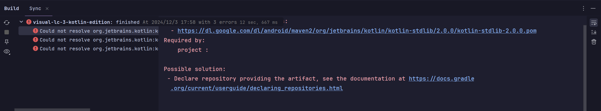
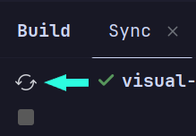
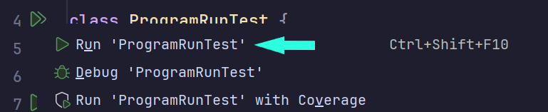

# 终极实验 S：Re LC-3

## 命运所指

> 抉择就在眼前，结局早已注定。

从 1 和 0 构成的机器代码，到标签和指令的世界，经历中断等等波折，再到熟悉而又陌生的 C 语言，不断的讲述和练习，计算系统庞大的结构在你的脑海中不断延伸，由朦胧的概念逐渐形成了似真似幻的构想，再演化成尤为清晰的形象。一切看似都已经趋近完美，只要**在这里停下**，为这个系列画上句号，你就可以从实验中“安全下车”，故事也将抵达它的尾页。你 ——

<style>
    .btn {
        background-color: rgba(255, 180, 220, 0);
        width: 80%; 
        border: 2px solid; 
        border-color: rgb(255, 154, 187, 0.7); 
        border-radius: 5px;
        color: inherit; 
        text-align: center;
        padding-top: 0.25rem;
        padding-bottom: 0.25rem;
        font-weight: bold;
        font-size: 1rem;
        transition: 200ms;
        cursor: pointer;
    }

    .btn:hover {
        border-color: #fff0b3;
        box-shadow: 0px 0px 10px #fff0b3;
    }
</style>

<script>


function acceptThat() {
    document.querySelectorAll("button.btn").forEach(e=>e.parentNode.remove());
    document.getElementById("t-accept").style.display = "initial";
    sessionStorage.setItem("op.final", "accept")
}

function rejectThat() {
    document.querySelectorAll("button.btn").forEach(e=>e.parentNode.remove());
    document.getElementById("t-reject").style.display = "initial";
    sessionStorage.setItem("op.final", "reject")
}

function makeConfirm(c)  {
    const t = c ? "就在这里结束" : "面对新的挑战";
    return confirm(`选择不能重来，${t}，确定吗？`)
}

window.acceptThat = acceptThat
window.rejectThat = rejectThat
window.makeConfirm = makeConfirm
window.finalOp = sessionStorage.getItem("op.final")

if(window.finalOp == "accept") acceptThat()
if(window.finalOp == "reject") rejectThat()
</script>

<div style="display: flex; justify-content: center; width: 100%; margin-top: 3rem;">
<button class="btn" onclick="makeConfirm(true) && acceptThat()">
接受这个命运
</button>
</div>

<div style="display: flex; justify-content: center; width: 100%; margin-top: 2rem; margin-bottom: 3rem;">
<button class="btn" onclick="makeConfirm(false) && rejectThat()">
不接受这个命运
</button>
</div>

<script>

</script>

<div style="display: none;" id="t-accept">

**接受这个命运。**

> 岁久人无千日好，春深花有几时红？

尾页已至，作家放下手中的笔，将结尾留给读者自作想象。在这里结束，倒也不失为一桩美谈。翻过封底，故事看似已然圆满，今后的事，你我都已知晓。

[退出至首页](/Labs/README)

</div>

<div style="display: none;" id="t-reject">

**不接受这个命运。**

> 莫嫌举世无知己，未有庸人不忌才。

描绘的画笔不曾停歇，构想的修辞流淌不竭，作家正将故事引上另一条路。有人欣喜，期待着尾页上的新章节；有人畏惧，担忧这临门一脚的变数。今后的事，我们尚不可知。

## 背景

没有软件的硬件是没有用的，而没有硬件的软件更是毫无意义的。能将汇编代码转换为机器代码固然是一件好事，但那并不是故事的全部。指令创生出来可不只是用来汇编的，更重要的是**执行**。在过去，LC3XT Sugar 一直在评测习题中默默地分析和执行指令，并尽职尽责地报告所发现的每个问题，而现在，是时候由你来接手这项工作了。

## 任务目标

构造一个 LC-3 用户模式虚拟机。

- 能够装载二进制代码并运行。

- 运行在用户模式下，但要支持 `OUT` 和 `PUTS` 进行输出。

- 需要实现除 `RTI` 外所有指令的执行，特别是 `TRAP` 调用。

## LC-3 组成原理

软件上的虚拟机构成与硬件上不同，并不是 LC-3 中的每一个物理模块都需要通过软件模拟，例如，在一次加法运算中，运算单元、控制器和各种控制信号在软件模拟中都不存在，而只需要简单使用加法运算符和赋值即可。必须要实现的模块缩减到以下几个：

- 寄存器堆：存储和维护 8 个通用寄存器的值。

- 内存：根据地址存储和读取内存内容。

- 解释器：读取指令，根据指令内容，改变相应存储器的值。

像是 PC、PSR、输入输出等模块，是内置在解释器中的。

## 开发计划

尽管构造虚拟机比构造汇编器要简单得多，但是从头开始搭设一个项目依然会带来些不必要的麻烦。我们在这里列出了一个开发计划，将整个开发过程划分为几个阶段。**每完成一个阶段，才能推进下一个阶段。**

### 阶段 0：搭设开发环境

你将需要以下资源：

- **Java 开发工具包（JDK）**
  
  我们使用的 Kotlin 基于 Java 虚拟机来运行，因此要先设置 Java 开发环境。开发所使用的版本是 Java 21。
  
  你可以从 [Adoptium 下载页面](https://adoptium.net/zh-CN/temurin/releases/?package=jdk&version=21) 下载 JDK，或者从下面的镜像获取：
  
  - [Windows x64](https://mirrors.ustc.edu.cn/adoptium/releases/temurin21-binaries/LatestRelease/OpenJDK21U-jdk_x64_windows_hotspot_21.0.5_11.msi)
  
  - [macOS x64](https://mirrors.ustc.edu.cn/adoptium/releases/temurin21-binaries/LatestRelease/OpenJDK21U-jdk_x64_mac_hotspot_21.0.5_11.pkg)
  
  - [macOS ARM](https://mirrors.ustc.edu.cn/adoptium/releases/temurin21-binaries/LatestRelease/OpenJDK21U-jdk_aarch64_mac_hotspot_21.0.5_11.pkg)
  
  - [GNU/Linux x64](https://mirrors.ustc.edu.cn/adoptium/releases/temurin21-binaries/LatestRelease/OpenJDK21U-jdk_x64_linux_hotspot_21.0.5_11.tar.gz)

对于其它操作系统或架构，请在官方网站上获取安装程序。

?> 如果你的电脑上同时还安装有 Minecraft，在安装了额外的 JDK 后，可能需要重新配置启动器，以免它们自动选中新安装的 JDK。

- **IntelliJ IDEA（社区版）**
  
  强大、易用而且免费的集成开发环境（IDE），你可以从 [JetBrains 的官方网站](https://www.jetbrains.com/idea/download/download-thanks.html?platform=windows&code=IIC) 上下载安装程序。
  
  ?> 如果你愿意，并且也知道如何使用，可以使用 Visual Studio Code、Eclipse 或者其它编辑器完成开发，但你将需要手动设置 Gradle 并运行测试。
  
  !> 尽管 IDEA 拥有中文翻译插件，但我们并不建议你使用它。请先尝试以英文界面操作，只在绝对必要时才使用翻译。

- **Git 版本管理工具**
  
  Git 是一个用于拉取、推送和管理不同版本源代码的工具，我们将使用 Git 来获取项目的源代码。你可以从 [Git 官方网站](https://git-scm.com/downloads) 下载 Git，安装时使用默认选项即可。

### 阶段 1：获取模板代码

模板代码存储在 [USTC LUG 的 GitLab](https://git.lug.ustc.edu.cn/skjsjhb/re-lc-3-kotlin-edition) 上，在此向参与维护这项服务的志愿者表示诚挚的感谢。

有两种方法可以获取源代码：

- 手动下载源代码并打开项目：
  
  1. 从 [这里](https://git.lug.ustc.edu.cn/skjsjhb/re-lc-3-kotlin-edition/-/archive/main/re-lc-3-kotlin-edition-main.zip) 下载源码包，并解压下载的 zip 归档，将其放到你希望存储项目的位置。
  
  2. 打开 IDEA，在主界面上单击 **Open**，并选择下载的源代码目录。

- 使用 IDEA 的版本管理工具：
  
  1. 打开 IDEA，在主界面上单击 **Clone Repository**。
  
  2. 在弹出窗口的 **URL** 一栏中，填入以下内容：
     
     ```
     https://git.lug.ustc.edu.cn/skjsjhb/re-lc-3-kotlin-edition.git
     ```
  
  3. 在 **Directory** 一栏中，填写你希望存储项目的位置。
  
  4. 单击 **Clone** 按钮。

在打开项目后，你可能会看到如下的警告：


单击 **Trust Project** 以信任源代码并打开项目。如果你担心源代码的安全性，也可以使用 **Preview in Safe Mode** 进行预览。

打开项目后，你将注意到右下角会显示 **Importing...** 等字样，稍等一会儿，直到右下角的进度条消失，代表项目导入成功。

> **如果出问题**
> 
> 有时你可能会看到这样的错误提示：
> 
> 
> 
> 这代表“同步错误”，也就是 Gradle（我们的构建工具）无法下载编译项目所需要的文件。我们在搭设环境时手动安装了 JDK 和 IDEA，但是并没有安装 Kotlin 编译器，这一步是由 IDEA 通过 Gradle 来完成的。遗憾的是，如果网络条件不好，Gradle 找不到所需的文件，就会产生错误。
> 
> 要解决这个问题，可以编辑 `build.gradle.kts` 文件，寻找下面的代码：
> 
> ```kotlin
> repositories {
>     mavenCentral()
> }
> ```
> 
> 并在 `mavenCentral()` 上添加一行，使之成为：
> 
> ```kotlin
> repositories {
>     maven("https://maven.aliyun.com/repository/public")
>     mavenCentral()
> }
> ```
> 
> 然后单击 **Build** 窗口中的 **Reload Gradle Project** 按钮，重新加载项目：
> 
> 

现在你可以在左侧的 **Project** 面板中，展开项目所使用的文件。要修改的文件都位于 `src/main/kotlin` 下。

?> Gradle 在构建项目时对于文件的存放位置有要求，如果你想在项目中添加额外的 Kotlin 源代码文件，请确保在 `src/main/kotlin` 中添加它们。

### 阶段 2：存储器实现

要实现的存储器包含内存和寄存器两个，分别位于 `src/main/kotlin/Memory.kt` 和 `src/main/kotlin/RegisterFile.kt` 中。内存部分已经为你写好，只需要补全寄存器的实现。

> **TODO 标记**
> 
> 当你在代码中看到这样的 `TODO()` 标记时：
> 
> ```kotlin
> fun asStringContent(): String {
>     require(type == TokenType.STRING)
> 
>     TODO("请实现此方法的剩余部分")
> }
> ```
> 
> 这代表**该函数还没有完整实现**，你需要根据代码注释**补全函数功能**（函数功能通常在函数头上方的文档 `/** */` 中有所描述），随后**删除**这个 `TODO()` 调用。

### 阶段 3：解释器实现

解释器是 LC-3 虚拟机的核心，位于 `src/main/kotlin/Interpreter.kt` 中。部分指令已经实现作为参考，而（大多数）其它指令的执行需要继续完成。根据指令功能，相应地修改存储器状态。

### 阶段 4：运行测试

以上工作完成后，展开 `src/test/kotlin` 目录，选择 `ProgramRunTest`，并单击 `class ProgramRunTest` 左侧的按钮运行测试：



如果一切正常，测试将会通过，否则 IDEA 会在控制台将发现的测试错误列出。参考测试结果，修正你的代码，直至通过整个测试。

?> 如果有兴趣，你还可以自行修改测试代码， 尝试其它的程序。

## 报告与提交

或许是最后一次，你将要用实验报告描述程序的功能。或许你会写得很长，或许你会觉得无话可说，总之作为漫长工作的一个收尾，请概括一下你的成果。不论你的时间是花在了配置环境、阅读代码、运行调试还是网络问题上，都请描述你的工作，这不仅是形式上的总结，也是对于你原创程序的亲笔签名。

终极实验 S 要求人工检查，我们将安排时间进行集中线下研讨，但如果错过了也没关系，你可以选择其它零散时间线上讨论。

---

</div>
